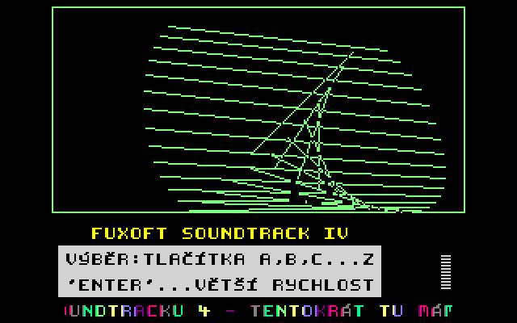

# SAPI-FXS4: Fuxoft Soundtrack IV pro SAPI-1

Port hudebního dema **Fuxoft Soundtrack IV** Františka Fuky (Fuxoft) ze ZX Spectra na počítač **Tesla SAPI-1**,
sestavu „V“ Libora Lasoty: CPU karta JPR-1V, paměť RAM-1V, barevná grafika **CGA-1V** a zvuková karta
**MPH-1V**. Program běží pod CP/M jako `FXS4.COM`.

Demo hraje 27 skladeb (26 na klávesách A–Z a jednu skrytou) a k tomu kreslí animaci čar, VU metry a rolující
text s Fukovým komentářem ke skladbám a básněmi Ernsta Jandla.



## Spuštění

Přeložit (`build.cmd`, viz níže) a dostat program do CP/M sestavy V:

- **Skutečný počítač:** přenést `build\fxs4.com` do CP/M kterýmkoli způsobem, který sestava umí (např.
  XMODEM přes sériovou linku programem `DOCPM.COM`), a spustit `FXS4`.
- **SAPIemu** (sestava `machines/sapi1v.sapi`): Soubor → Nahrát program do paměti (`build\fxs4.hex`, od
  0100h), v CP/M `SAVE 158 FXS4.COM` a spustit `FXS4`.

Obraz je na výstupu CGA-1V, zvuk na MPH-1V. Program běží při 4 i 2 MHz (propojka TURBO na JPR-1V).

## Ovládání

| Klávesa | Co dělá |
|---|---|
| A–Z | skladba A–Z (malá i velká písmena) |
| `-` | skrytá 27. skladba (na Spectru se k ní nedalo dostat) |
| ENTER | zrychlení hudby, dokud se drží (3× rychleji) |
| mezerník | nová animace čar |
| ostatní | změna směru animace |
| ESC | návrat do CP/M |

SAPI klávesnice nehlásí puštění klávesy, proto se klávesa bere jako stisknutá krátce po příchodu znaku.
ENTER se drží déle (0,6 s), s automatickým opakováním klávesnice PC v emulátoru zrychlení trvá.

## Skladby

Podle Fukova rolujícího textu:

| | Skladba |
|---|---|
| A | Rob Hubbard: Monty on the Run (C64), závěr z Hubbardova Rasputina |
| B | Fuka: ke hře Master of Magic |
| C | J. M. Jarre: část z Concert in China |
| D | variace na Terra Cresta (Martin Galway) |
| E | Fuka: jedno z prvních děl, doprovod ke hře Zub |
| F | mix dvou hudeb z C64: Penetrator a Crazy Comets |
| G | J. S. Bach: fuga (trojhlasá) |
| H | Fuka: ke hře Feud |
| I | variace na Hubbardovu hudbu ze hry The Last V8 |
| J | Rob Hubbard: Chimera (zrychlená) |
| K | Rob Hubbard: Commando |
| L | Ray Parker Jr.: Ghostbusters |
| M | Policajt v Beverly Hills (psáno zpaměti) |
| N | pokus o imitaci hudby Johna Williamse z filmu E.T. |
| O | další od J. M. Jarra |
| P | Fuka: pro Fídlerovu hru Jet-Story |
| Q | W. A. Mozart: Turecký pochod |
| R | Fuka: ze hry F.I.R.E. |
| S | Fuka: vlastní tvorba (pochmurná) |
| T | Genesis: Land of Confusion |
| U | třetí od J. M. Jarra |
| V | variace na A View to a Kill (Duran Duran, John Barry) |
| W | Fuka: pseudostředověká hudba pro Fídlerovu textovou hru Belegost |
| X | znělka Zlatého trojúhelníku, původně John Williams: The Mission (Amazing Stories) |
| Y | John Williams: Indiana Jones |
| Z | další od J. M. Jarra |
| `-` | skrytá skladba, v textu se nezmiňuje |

## Co je jinak než na Spectru

- **Hudba hraje přesně jako originál.** Přehrávač a data skladeb jsou původní a registry zvukového čipu jsou
  v každém tiknutí stejné jako na Spectru (ověřeno v emulátorech). Jen čip je jiný: SAPI má YM3812 (FM),
  Spectrum AY-3-8912. Port převádí tóny, šum a hlasitosti AY na YM3812, takže barva zvuku je trochu jiná.
- **Obraz je na první pohled stejný, ale kreslí se po svém** na CGA-1V (320 × 200, obraz Spectra uprostřed):
  - rolující text jede plynule a duha přes něj přebíhá o písmeno za snímek (na Spectru po sloupcích);
  - po mezerníku se animace vymaže a začne načisto (na Spectru staré čáry zůstávaly na obrazovce);
  - skrytá skladba má klávesu `-`;
  - není kopírování na kazetu (BASIC originálu) a border nebliká při hraní.

## Původ a stav

- **Originál:** `Demos/FXSOUND4.TAP`, ZX Spectrum 48K s AY (128K nebo Melodik). Autor František Fuka (Fuxoft).
- **Port:** Martin Lukášek s Claude (2026). Ze strojového kódu originálu je udělaný symbolický disassembler
  (`orig/fxs4.asm`). Port je jeho kopie se změnami a vlastní obsluhou hardwaru SAPI.
- **Stav:** hotové, ověřené v emulátoru SAPIemu i na skutečné sestavě V. Na skutečné CGA-1V obraz lehce
  „sněží“.

## Překlad

Potřeba: Python 3 a assembler pasmo 0.5.3 (`E:\SAPI_GIT\Tools\pasmo-0.5.3\pasmo.exe`, jinde proměnná `PASMO`).

```
build.cmd
```

Vznikne `build\fxs4.com`, `build\fxs4.hex` (od 0100h) a `build\fxs4.sym`. Na konci se vypíše počet stránek
pro `SAVE`.

## Dokumentace

- `docs/SOUHRN.md`: stav, postup na novém počítači, rozhodnutí, další kroky, otázky k ověření na HW.
- `docs/vyvoj.md`: technika: rozbor originálu, disassembler, formát skladeb, jak je port udělaný, časování,
  zvuk, nástroje a ověřování.
